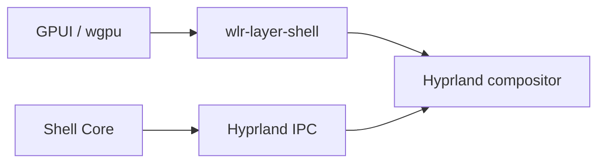
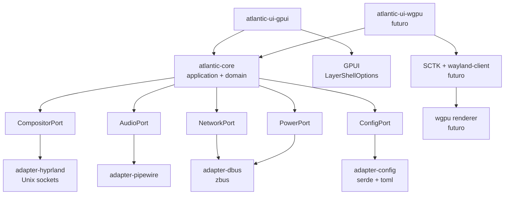
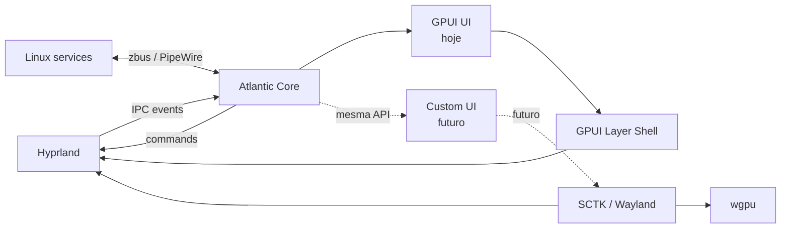

# GPUI + Hyprland em Rust para uma shell Linux

## Resumo executivo

**GPUI já é tecnicamente viável para construir um panel/notch/launcher no Hyprland.** O estado atual do upstream é bem melhor do que há alguns anos: no Linux/Wayland, GPUI expõe `LayerShellOptions`, `Layer`, `Anchor`, `KeyboardInteractivity`, `exclusive_zone`, `exclusive_edge` e `margin`; o backend converte isso diretamente para `zwlr_layer_shell_v1`. Ou seja, para o seu caso, você **não precisa implementar `wlr-layer-shell` manualmente só para colocar uma janela acima dos aplicativos**. citeturn6view0turn19view2

O porém é importante: **GPUI continua pre-1.0 e o próprio projeto avisa que breaking changes são frequentes**. A documentação também ainda é incompleta; o código do Zed continua sendo uma das principais referências. Portanto, eu usaria GPUI, mas **fixaria uma revisão/versionamento e jamais deixaria tipos GPUI vazarem para o core da shell**. citeturn22view0

Há pelo menos um caso real e relevante: **[zlaunch](https://github.com/zortax/zlaunch)**, launcher/window-switcher Wayland escrito em Rust com GPUI, com suporte explícito a Hyprland, Niri, KWin e MangoWM. Ele usa GPUI diretamente via Git do Zed. Nas fontes primárias que consegui verificar, porém, ainda não existe um ecossistema maduro de shells completas em GPUI comparável ao que existe com Qt/Quickshell; zlaunch é mais uma prova prática de que a abordagem funciona do que evidência de maturidade de uma “stack de desktop shell”. citeturn34view0turn36view1

Minha recomendação para uma shell Hyprland seria:

```text
Hoje:
GPUI
  + layer-shell nativo do GPUI
  + Hyprland IPC
  + zbus
  + PipeWire
  + serde/toml

Futuro, se GPUI limitar você:
SCTK / wayland-client
  + wgpu
  + seu próprio scene graph/UI
```

**Eu não faria `winit + wgpu` como destino final obrigatório.** Para uma shell Wayland, `winit` é uma abstração genérica de janela/event-loop; sua documentação não fornece layer-shell como conceito de primeira classe. Para uma implementação própria de shell, `smithay-client-toolkit + wayland-client + wayland-protocols-wlr + wgpu` é arquiteturalmente mais natural. Isso é uma inferência baseada nas APIs: SCTK expõe especificamente `wlr_layer`, enquanto winit se concentra em janelas tradicionais e eventos. citeturn38view1turn26view0

## GPUI, Wayland e layer-shell

GPUI se define hoje como um framework de UI GPU-accelerated híbrido entre retained e immediate mode. Ele fornece estado por `Entity`, views declarativas via `Render`, elementos de baixo nível, layout, input, foco, async executor e serviços de plataforma. No Linux, o `gpui_platform` pode ser compilado somente com Wayland, evitando o backend X11 quando ele não for necessário. citeturn22view0

Para seu caso, a parte decisiva é esta API do upstream:

```rust
gpui::platform::layer_shell::{
    Layer,
    Anchor,
    KeyboardInteractivity,
    LayerShellOptions,
}
```

`Layer` representa:

```text
Background
Bottom
Top
Overlay
```

e `Anchor` fornece combinações de:

```text
TOP
BOTTOM
LEFT
RIGHT
```

Além disso, `LayerShellOptions` carrega namespace, layer, anchors, `exclusive_zone`, `exclusive_edge`, margem e política de teclado. Tudo isso só é exposto no Linux com a feature Wayland habilitada. citeturn6view0turn9view1

A implementação não é uma gambiarra externa: o backend Wayland do GPUI detecta `WindowKind::LayerShell`, chama `get_layer_surface()`, configura tamanho, anchors, keyboard interactivity, margins e exclusive zone e mantém um `ZwlrLayerSurfaceV1`. citeturn19view2

Mais interessante ainda: **GPUI no Wayland já renderiza usando wgpu internamente**. O backend cria um `gpui_wgpu::GpuContext`, constrói um `WgpuRenderer`, cria uma surface transparente e prefere `PresentMode::Mailbox` quando disponível. Então uma futura migração para wgpu próprio **não troca a tecnologia de GPU; ela remove a camada de UI/layout/text/input do GPUI e passa esse trabalho para você**. citeturn19view2

### Um panel com GPUI

A forma da configuração upstream atual é essencialmente esta; como GPUI é pre-1.0, vale piná-lo e conferir os imports/`WindowOptions` da revisão usada. citeturn6view0turn22view0

```rust
use gpui::px;
use gpui::platform::layer_shell::{
    Anchor,
    KeyboardInteractivity,
    Layer,
    LayerShellOptions,
};

let layer_options = LayerShellOptions {
    namespace: "atlantic-panel".into(),

    // Barra normal acima das aplicações.
    layer: Layer::Top,

    // Barra presa no topo e ocupando horizontalmente o output.
    anchor: Anchor::TOP | Anchor::LEFT | Anchor::RIGHT,

    // Reserva 36 px para que janelas maximizadas não ocupem esse espaço.
    exclusive_zone: Some(px(36.0)),
    exclusive_edge: Some(Anchor::TOP),

    // Uma barra comum não deveria roubar foco de teclado.
    keyboard_interactivity: KeyboardInteractivity::None,

    ..Default::default()
};

// Na API atual, isso é usado como:
// WindowKind::LayerShell(layer_options)
// dentro das opções da janela GPUI.
```

O backend GPUI transforma exatamente essas opções em requests de `zwlr_layer_surface_v1`. citeturn19view2

Para um **notch** como o Ambxst, eu mudaria para algo conceitualmente assim:

```rust
LayerShellOptions {
    namespace: "atlantic-notch".into(),
    layer: Layer::Overlay,
    anchor: Anchor::TOP,

    // Não empurra as janelas normais.
    exclusive_zone: None,

    keyboard_interactivity: KeyboardInteractivity::None,

    ..Default::default()
}
```

`Overlay` é apropriado para superfícies que devem permanecer acima das demais layers; `Top` é normalmente melhor para uma barra convencional. citeturn6view0

O projeto [zlaunch](https://github.com/zortax/zlaunch) demonstra que GPUI já está sendo usado desse modo em um software Wayland real orientado a Hyprland, embora seja launcher, não uma desktop shell completa. citeturn34view0

## Hyprland, input e IPC

`wlr-layer-shell` é quem define a semântica real. O protocolo permite `set_size`, `set_anchor`, `set_exclusive_zone`, `set_margin`, `set_keyboard_interactivity`, mudança de layer e, nas versões mais novas, `set_exclusive_edge`. citeturn29view0

Para uma barra superior:

```text
layer          = top
anchor         = top | left | right
height         = 36
exclusive_zone = 36
keyboard       = none
```

Para uma surface de 36 px presa a `TOP | LEFT | RIGHT`, uma exclusive zone positiva diz ao compositor que aquela região deve ser considerada reservada. O protocolo ressalta que uma zone positiva só é significativa em determinadas combinações de anchors; `TOP | LEFT | RIGHT` é justamente a forma típica de uma barra superior. `0` não reserva espaço e aceita ser reposicionado por outras exclusive zones; `-1` pede para ignorá-las e estender-se até os anchors. citeturn29view0

Para input, layer-shell surfaces recebem pointer/touch/tablet normalmente; teclado é separado e começa desabilitado. Uma surface que deve ser completamente click-through pode usar uma `wl_surface` input region vazia. GPUI já possui `set_input_region()` no backend de plataforma, além de `set_exclusive_zone()` e `set_exclusive_edge()`. citeturn29view0turn37view5

Isso é especialmente útil para uma shell fullscreen transparente:

```text
┌─────────────────────────────────────────┐
│           Região clicável               │
│            ┌────────┐                   │
│            │ notch  │                   │
│            └────────┘                   │
│                                         │
│      restante da surface: click-through │
│                                         │
└─────────────────────────────────────────┘
```

É o mesmo princípio arquitetural que você viu no Quickshell: uma surface pode ser grande, enquanto a região efetivamente interativa é pequena. O protocolo Wayland permite isso através da input region. citeturn29view0

### Sem GPUI: SCTK direto

Caso você substitua GPUI no futuro, [`smithay-client-toolkit`](https://crates.io/crates/smithay-client-toolkit) já possui abstrações específicas para `wlr_layer`: `LayerShell`, `LayerSurface`, `Anchor`, `Layer` e `KeyboardInteractivity`. citeturn26view0turn26view1

O núcleo da criação de uma barra fica próximo disto; delegates e event-loop foram omitidos:

```rust
use smithay_client_toolkit::{
    compositor::CompositorState,
    shell::wlr_layer::{
        Anchor,
        KeyboardInteractivity,
        Layer,
        LayerShell,
    },
};

// Depois de Connection + registry_queue_init + QueueHandle...

let surface = compositor.create_surface(&qh);

let panel = layer_shell.create_layer_surface(
    &qh,
    surface,
    Layer::Top,
    Some("atlantic-panel".into()),
    None, // output; None permite ao compositor escolher
);

panel.set_anchor(
    Anchor::TOP | Anchor::LEFT | Anchor::RIGHT
);

// 0 = compositor determina a largura porque LEFT + RIGHT estão ancorados.
panel.set_size(0, 36);

panel.set_exclusive_zone(36);
panel.set_keyboard_interactivity(KeyboardInteractivity::None);

panel.commit();
```

O uso de largura `0` com anchors opostos segue diretamente a especificação: o compositor pode atribuir a dimensão omitida, mas essa dimensão precisa estar ancorada nos dois lados opostos. citeturn29view0turn26view0

### IPC do Hyprland

Não misture layer-shell com IPC. São duas responsabilidades distintas:



Hyprland atualmente fornece dois UNIX sockets por instância:

```text
$XDG_RUNTIME_DIR/hypr/$HYPRLAND_INSTANCE_SIGNATURE/.socket.sock
$XDG_RUNTIME_DIR/hypr/$HYPRLAND_INSTANCE_SIGNATURE/.socket2.sock
```

O primeiro recebe requests equivalentes a `hyprctl`; o segundo mantém um stream de eventos no formato `EVENT>>DATA\n`, incluindo `workspace`, `activewindow`, `openwindow`, `closewindow`, `openlayer`, `monitoradded`, etc. O próprio Hyprland alerta que requests no primeiro socket são processados sincronamente e conexões não fechadas podem bloquear o compositor até o timeout, portanto abra → escreva → leia → feche rapidamente. citeturn28view0

Em Rust você nem precisa inicialmente de uma biblioteca Hyprland:

```rust
use anyhow::{Context, Result};
use std::{
    env,
    io::{Read, Write},
    net::{Shutdown, UnixStream},
};

fn hypr_request(request: &str) -> Result<String> {
    let runtime = env::var("XDG_RUNTIME_DIR")
        .context("XDG_RUNTIME_DIR não definido")?;

    let instance = env::var("HYPRLAND_INSTANCE_SIGNATURE")
        .context("não estamos em uma sessão Hyprland?")?;

    let socket = format!(
        "{runtime}/hypr/{instance}/.socket.sock"
    );

    let mut stream = UnixStream::connect(socket)?;

    // Exemplo: "j/clients"
    stream.write_all(request.as_bytes())?;
    stream.shutdown(Shutdown::Write)?;

    let mut response = String::new();
    stream.read_to_string(&mut response)?;

    Ok(response)
}
```

Para estado reativo, mantenha uma conexão separada em `.socket2.sock`, leia as linhas e converta os eventos em mensagens do domínio. Isso permite atualizar workspace, active window e monitores sem polling. citeturn28view0

## Crates Rust para uma shell sem C++

Uma distinção importante: **“aplicação escrita em Rust” e “dependency graph sem C/C++” são coisas diferentes**. `wgpu`, por exemplo, é apresentado como API gráfica safe e pure-Rust; já `skia-safe` é binding de Skia, e PipeWire inevitavelmente coloca você em contato com componentes nativos do sistema. citeturn38view2

| Área | Crates | Eu usaria |
|---|---|---|
| Matemática gráfica | [`glam`](https://crates.io/crates/glam), [`nalgebra`](https://crates.io/crates/nalgebra), [`cgmath`](https://crates.io/crates/cgmath) | **glam** para renderer/UI; nalgebra se realmente precisar de álgebra mais sofisticada |
| Bitmap | [`image`](https://crates.io/crates/image) | PNG/JPEG/WebP e manipulação raster |
| SVG | [`resvg`](https://crates.io/crates/resvg) | **Minha escolha para ícones SVG** |
| Rasterização CPU | [`raqote`](https://crates.io/crates/raqote) | Só quando GPU não fizer sentido |
| GPU | [`wgpu`](https://crates.io/crates/wgpu) | **Renderer próprio recomendado** |
| Paths/vetores | [`lyon`](https://crates.io/crates/lyon) | Tessellation de shapes/paths para wgpu |
| Skia | [`skia-safe`](https://crates.io/crates/skia-safe) | Poderoso, mas **não elimina C++** |
| Playback de áudio | [`rodio`](https://crates.io/crates/rodio) | Sons da própria shell |
| Audio I/O | [`cpal`](https://crates.io/crates/cpal) | Capture/playback low-level |
| PipeWire | [`pipewire`](https://crates.io/crates/pipewire) | Integração real com PipeWire |
| D-Bus | [`zbus`](https://crates.io/crates/zbus) | **Preferência para serviços Linux** |
| D-Bus alternativo | [`dbus`](https://crates.io/crates/dbus) | Quando precisar especificamente do ecossistema dbus-rs |
| Serialização | [`serde`](https://crates.io/crates/serde) | Estado/config |
| Config | [`toml`](https://crates.io/crates/toml) | Configuração humana |
| Wayland | [`wayland-client`](https://crates.io/crates/wayland-client) | Protocolo base |
| Wayland toolkit | [`smithay-client-toolkit`](https://crates.io/crates/smithay-client-toolkit) | **Base recomendada de uma futura UI própria** |
| Protocolos wlroots | [`wayland-protocols-wlr`](https://crates.io/crates/wayland-protocols-wlr) | layer-shell etc. |
| Syscalls/Linux | [`nix`](https://crates.io/crates/nix) | Unix sockets, signals, fd, processos |
| systemd | [`sd-notify`](https://crates.io/crates/sd-notify) | readiness/watchdog |
| Hyprland | [`hyprland`](https://crates.io/crates/hyprland) | Conveniência; socket direto continua útil |

O trio Wayland mais interessante para seu projeto é:

```text
wayland-client
       │
       ▼
smithay-client-toolkit
       │
       ├── compositor
       ├── output
       ├── seats/input
       ├── xdg-shell
       └── wlr-layer-shell

wayland-protocols-wlr
       └── protocolos gerados
```

SCTK é explicitamente uma toolkit para escrever clientes Wayland sobre `wayland-client` e já possui o módulo `shell::wlr_layer`. citeturn26view0turn26view1

Para renderização custom:

```text
Wayland/SCTK
     │
     ▼
 wl_surface
     │
     ▼
   wgpu
     │
     ├── glam      transformações
     ├── lyon      paths
     ├── resvg     SVG/icons
     └── image     bitmaps
```

`wgpu` fornece uma API gráfica cross-platform em Rust com backends Vulkan/GLES no Linux; é exatamente o tipo de surface que você acabaria criando ao retirar a infraestrutura de UI do GPUI. citeturn38view2

Um detalhe onde eu evitaria uma escolha ruim: **`rodio` e `cpal` não são substitutos para o mixer do desktop**. Eles fazem sentido quando a sua aplicação quer produzir/capturar áudio. Para mostrar e controlar sink/source/volume do sistema, a integração pertence ao adapter PipeWire/serviço equivalente, não à camada de playback.

Da mesma forma, para Wi-Fi você provavelmente não quer “uma crate de networking”: shell desktop deve conversar com **NetworkManager via D-Bus**, assim como BlueZ, UPower, MPRIS, notifications e vários serviços do desktop podem ficar atrás de adapters `zbus`. Isso reduz brutalmente a quantidade de código específico de sistema espalhado pela UI.

## Arquitetura recomendada

Aqui arquitetura hexagonal faz sentido, mas com uma ressalva: **não tente abstrair GPUI e wgpu criando um “framework UI genérico” no seu core**. Isso vira abstração lixo rapidamente.

O que você deve abstrair são **capacidades da shell e semântica de plataforma**, não `div`, flexbox, padding ou shaders.



Eu faria também um pequeno contrato `PanelSpec` independente de toolkit:

```rust
pub struct PanelSpec {
    pub layer: PanelLayer,
    pub anchors: Anchors,
    pub exclusive_zone: Option<i32>,
    pub keyboard: KeyboardMode,
    pub input_regions: Vec<Rect>,
}

pub enum PanelLayer {
    Background,
    Bottom,
    Top,
    Overlay,
}

pub enum KeyboardMode {
    None,
    OnDemand,
    Exclusive,
}
```

Então:

```text
PanelSpec
    │
    ├── GPUI adapter
    │      └── LayerShellOptions
    │
    └── Wayland adapter
           └── SCTK LayerSurface
```

Isso é muito mais valioso do que tentar criar:

```rust
trait UniversalButton {}
trait UniversalDiv {}
trait UniversalFlexbox {}
```

Esse segundo caminho vira um toolkit próprio **antes de você ter motivo para construir um toolkit próprio**.

Eu começaria com um workspace assim:

```text
atlantic/
├── Cargo.toml
└── crates/
    ├── atlantic-core/
    │   ├── domain/
    │   ├── application/
    │   └── ports/
    │
    ├── atlantic-platform/
    │   ├── panel_spec.rs
    │   └── geometry.rs
    │
    ├── atlantic-hyprland/
    │   ├── commands.rs
    │   ├── events.rs
    │   └── state.rs
    │
    ├── atlantic-dbus/
    │   ├── network_manager.rs
    │   ├── bluez.rs
    │   ├── upower.rs
    │   └── notifications.rs
    │
    ├── atlantic-audio/
    │   └── pipewire.rs
    │
    ├── atlantic-config/
    │   └── toml.rs
    │
    ├── atlantic-ui-gpui/
    │   ├── panel.rs
    │   ├── notch.rs
    │   ├── widgets/
    │   └── theme.rs
    │
    └── atlantic-app/
        └── main.rs
```

A dependência deve apontar para dentro:

```text
                 atlantic-core
                ▲     ▲      ▲
                │     │      │
             hypr   dbus   audio

                 ▲
                 │
              ui-gpui
```

Nunca:

```text
core → gpui
core → Hyprland
core → PipeWire
```

Assim a arquitetura hexagonal realmente compra algo para você.

## Migração, desempenho e tamanho

A migração **GPUI → renderer próprio não será “trocar GPUI por wgpu”**, porque GPUI já usa wgpu no backend Wayland. Você estará substituindo principalmente layout, widgets, text shaping/rasterization, scene construction, hit-testing, foco, teclado, IME, clipboard, accessibility, animations, popups e integração de janela. citeturn19view2turn22view0

Arquitetura hexagonal preservaria:

```text
✓ domínio
✓ application services
✓ Hyprland IPC
✓ D-Bus
✓ PipeWire
✓ config
✓ modelos
✓ regras de estado
✓ boa parte de assets/parsers
```

Mas provavelmente reescreveria:

```text
✗ views GPUI
✗ layout GPUI
✗ widgets
✗ animações ligadas ao toolkit
✗ event handlers visuais
✗ foco/hit-testing
✗ rendering
```

Minha estimativa de engenharia, **não um benchmark**, seria: um panel simples e bem isolado pode ser migrado em algo como **1–3 semanas de um desenvolvedor experiente** se o renderer básico, texto e SVG já estiverem prontos; uma shell com panel + notch + notifications + launcher + system tray + popups pode facilmente virar **1–3 meses**; uma UI própria realmente polida, incluindo IME, acessibilidade, text shaping robusto e edge cases multi-monitor, pode entrar em **vários meses**. Sem tamanho atual da aplicação, complexidade dos widgets e metas de compatibilidade, um número mais preciso seria falso rigor.

### Comparação prática

As faixas abaixo são **ordens de grandeza para planejamento**, não medições oficiais comparáveis. O target exato de RAM não foi especificado. RSS ainda pode ser enganoso devido a bibliotecas compartilhadas, memória do driver, mmap e buffers GPU; para comparação séria, use o mesmo sistema e observe PSS junto de RSS.

| Stack | Binário release estimado | RAM runtime estimada | Dependências | Maturidade | Layer-shell |
|---|---:|---:|---|---|---|
| **GPUI** | ~15–50 MiB | ~50–200 MiB | Rust + wgpu + Wayland + text stack | **Média**, pre-1.0 | **Boa, ~4/5** |
| **winit + wgpu** | ~8–30 MiB | ~20–100+ MiB | Rust + GPU; precisa adicionar Wayland/SCTK para shell | Fundação madura; UI é sua | **Ruim puro, ~1/5** |
| **SCTK + wgpu** | ~8–30 MiB | ~20–100+ MiB | Wayland + Rust + GPU | Boa infraestrutura, UI é sua | **Boa, ~4/5** |
| **Quickshell + QtQuick** | executável relativamente pequeno; Qt fica externo | ~50–200+ MiB | Qt6/QML/QtQuick + Quickshell | Qt muito maduro; shell especializada | **Excelente, ~5/5** |

GPUI oficialmente continua pre-1.0 e instável em API; winit é uma biblioteca madura para criação de janelas/event-loop, mas não desenha UI; wgpu fornece a API gráfica; SCTK possui abstração específica para wlr-layer-shell. Quickshell, por contraste, entrega diretamente `PanelWindow`, anchors, `exclusiveZone`, foco e “above windows”, tornando layer-shell praticamente uma propriedade QML. citeturn22view0turn38view1turn38view2turn26view0turn38view0

Isso também mostra por que comparar apenas tamanho do executável é enganoso:

```text
Quickshell
  pequeno executável
       +
  Qt6 / QML / QtQuick compartilhados

GPUI
  executável Rust maior
       +
  backend Wayland/wgpu embutido na aplicação

Custom
  wgpu + Wayland
       +
  exatamente os subsistemas que você decidir implementar
```

GPUI permite compilar o `gpui_platform` somente com Wayland no Linux, o que é uma otimização óbvia no Hyprland; winit, por padrão, habilita tanto X11 quanto Wayland, então também vale desabilitar features desnecessárias se ele entrar no projeto. citeturn22view0turn38view1

O ponto brutal é: **renderer próprio não é automaticamente mais leve**. Se você implementar cache de glyphs ruim, redraw contínuo, buffers excessivos, SVG rasterizado repetidamente ou atlas de textura mal administrado, consegue facilmente construir algo pior que GPUI. Winit inclusive recomenda um event loop `Wait` para aplicações que só atualizam em resposta a eventos, porque polling contínuo consome mais CPU/energia. citeturn38view1

## Projeto inicial e prioridades

Eu começaria **GPUI-first, mas GPUI-disposable**. Isso permite entregar a shell sem assumir desde já o custo absurdo de escrever um toolkit.

A ordem de implementação que maximiza aprendizado e minimiza retrabalho seria:

**Primeiro, plataforma e estado.** Implemente `atlantic-core`, `PanelSpec`, adapter de Hyprland e subscription do `.socket2.sock`. Faça workspace ativo, active window, monitores e fullscreen funcionarem antes de gastar tempo em blur e animações. O IPC oficial do Hyprland já fornece os eventos necessários para esse estado reativo. citeturn28view0

**Depois, um único panel GPUI.** Use `Layer::Top`, `TOP | LEFT | RIGHT`, `exclusive_zone`, `KeyboardInteractivity::None` e uma única surface por monitor. GPUI já traduz isso diretamente para `zwlr_layer_shell_v1`. citeturn6view0turn19view2

**Em seguida, notch/overlay.** Faça outra surface com `Layer::Overlay`, sem exclusive zone, e controle a input region para não transformar áreas transparentes em bloqueadores de clique. O protocolo explicitamente prevê input regions e GPUI já expõe suporte no backend. citeturn29view0turn37view5

**Depois vêm os adapters Linux:** `zbus` para NetworkManager/BlueZ/UPower/MPRIS/notifications, PipeWire para áudio, `serde + toml` para configuração. Isso deve atualizar modelos no core; a UI recebe estado pronto, em vez de executar `hyprctl`, `wpctl`, `nmcli` ou comandos shell dentro de widgets.

Só então eu faria system tray, notifications, launcher, clipboard e animações avançadas.

E **somente depois de existir uma shell real e perfilada** decidiria se GPUI deve morrer. O upstream já fornece layer-shell e usa wgpu por baixo; portanto reescrever tudo agora em `winit + wgpu` para “ter controle” provavelmente seria otimização prematura. citeturn19view2turn22view0

A arquitetura que eu escolheria hoje seria:



**Conclusão:** para uma shell focada em Hyprland, GPUI deixou de ser uma aposta absurda e passou a ser uma opção tecnicamente defensável. O suporte upstream a layer-shell resolve justamente a parte que antes tornava GPUI inadequado para bars/launchers/notches. citeturn6view0turn19view2

Mas eu não casaria a arquitetura com ele. Usaria GPUI como **presentation adapter**, modelaria `PanelSpec` e integrações Linux fora dele, e manteria como plano B **SCTK + wayland-client + wgpu**, não simplesmente `winit + wgpu`. `winit` é excelente para aplicações desktop comuns; para uma shell que precisa falar diretamente a linguagem do compositor Wayland, SCTK é a abstração que está no nível certo. citeturn26view0turn38view1